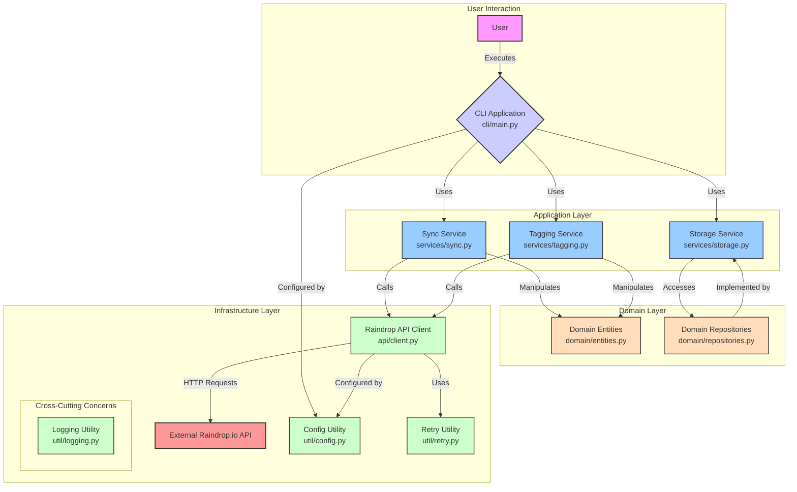

# Raindrop Enhancer Architecture

This document provides a detailed overview of the architectural design and components of the Raindrop Enhancer application.

## 1. High-Level Architecture

The application is designed with a layered architecture that separates concerns into distinct components:

- **User Interface (CLI):** The entry point for user interaction, responsible for parsing commands and displaying output.
- **Application Services:** Core business logic for syncing, tagging, and data manipulation.
- **Domain Model:** Defines the core data structures (entities) and their storage interfaces (repositories).
- **Infrastructure:** Contains components that interact with external systems and provide utility functions, such as API clients, database connections, and configuration management.
- **External Systems:** Third-party services that the application integrates with, like the Raindrop.io API.

## 2. Component Breakdown

### 2.1. User Interface (CLI)

- **File:** `src/raindrop_enhancer/cli/main.py`
- **Framework:** `click`

The CLI is the primary interface for the application. It provides commands for syncing data, managing configuration, and checking the application's status.

**Key Commands:**

- `app`: The main command group that initializes the configuration and console.
- `sync`: Triggers a data synchronization process. It supports two modes:
    - `full`: Fetches and processes all Raindrop links.
    - `incremental`: Fetches and processes links updated since a specified time.
- `configure`: Interactively sets up the application's configuration, such as the database path and API token.
- `status`: Displays a summary of the last synchronization run.
- `reprocess`: A placeholder for future functionality to reprocess existing links.

### 2.2. Application Services

#### 2.2.1. Sync Service

- **File:** `src/raindrop_enhancer/services/sync.py`

The Sync Service orchestrates the process of fetching data from Raindrop.io, enriching it, and storing it locally.

**Key Functions:**

- `run_full_sync(...)`: Implements the logic for a full synchronization. It fetches all links, extracts their web content, suggests tags, and saves the enriched data.
- `run_incremental_sync(...)`: Implements the logic for an incremental synchronization, processing only the links that have been updated since the last run.
- `extract_content(...)`: Uses the `trafilatura` library to extract the main content from a given URL.
- `enrich_metadata(...)`: Merges the extracted content with the original link data and flags links that may require manual review.

#### 2.2.2. Tagging Service

- **File:** `src/raindrop_enhancer/services/tagging.py`

This service is responsible for suggesting relevant tags for content, intended to be powered by a pluggable Language Model (LLM).

**Key Class:** `TaggingService`

- `__init__(...)`: Initializes the service with an LLM client, a confidence threshold for filtering tags, and retry logic.
- `batch_suggest_tags(...)`: Sends content in batches to the LLM for tag suggestions and filters the results based on a confidence score.
- `suggest_tags_for_content(...)`: A convenience method for suggesting tags for a single piece of content.

#### 2.2.3. Storage Service

- **File:** `src/raindrop_enhancer/services/storage.py`

Provides helper functions for writing data to the local filesystem, specifically for creating JSON exports.

**Key Functions:**

- `write_export(...)`: Writes data to a JSON file with schema versioning, ensuring idempotency by checking if the content has changed before writing.

### 2.3. Domain Model

#### 2.3.1. Entities

- **File:** `src/raindrop_enhancer/domain/entities.py`
- **Framework:** `SQLModel`

This module defines the core data structures of the application as `SQLModel` classes, which map to database tables.

**Key Models:**

- `LinkRecord`: Represents a single bookmark from Raindrop.io, including its URL, title, tags, and timestamps.
- `Collection`: Represents a collection or folder in Raindrop.io.
- `SyncRun`: Records metadata about each synchronization process, including its mode, duration, and the number of links processed.
- `ConfigSettings`: A key-value store for application settings within the database.
- `TagSuggestion`: Stores a tag suggested by the Tagging Service, along with its confidence score.

#### 2.3.2. Repositories

- **File:** `src/raindrop_enhancer/domain/repositories.py`

The `Repo` class provides an abstraction layer for all database operations, encapsulating the logic for creating, reading, updating, and deleting records.

**Key Class:** `Repo`

- `__init__(...)`: Initializes the repository with a path to the SQLite database and creates a `SQLAlchemy` engine.
- `setup()`: Creates the database schema and enables Write-Ahead Logging (WAL) for better concurrency.
- `upsert_*` methods (e.g., `upsert_link`, `upsert_sync_run`): These methods either insert a new record or update an existing one if it already exists in the database.
- `get_*` and `list_*` methods: Provide read access to the data.
- `get_links_updated_since(...)`: A specific query to support incremental syncs.

### 2.4. Infrastructure

#### 2.4.1. Raindrop.io API Client

- **File:** `src/raindrop_enhancer/api/client.py`

This component is responsible for all communication with the external Raindrop.io API. (Note: The implementation details are not fully shown in the provided files but are inferred from the architecture).

#### 2.4.2. Utility Modules

- **Path:** `src/raindrop_enhancer/util/`

This package contains various helper modules:

- `config.py`: Manages reading and writing the application's configuration file.
- `logging.py`: Sets up structured logging for the application.
- `retry.py`: Provides a decorator or class for adding retry logic to function calls, which is useful for network requests.

## 3. Data Flow: Sync Process

1.  A user initiates a sync from the **CLI**.
2.  The **CLI** calls the appropriate function in the **Sync Service** (`run_full_sync` or `run_incremental_sync`).
3.  The **Sync Service** uses the **Repository** to fetch the list of links to process (either all or just the updated ones).
4.  For each link, the **Sync Service** calls the **Content Extractor** (`trafilatura`) to get the article's text.
5.  The extracted text is sent to the **Tagging Service**.
6.  The **Tagging Service** communicates with the **LLM Client** to get tag suggestions.
7.  The **Sync Service** combines the original link data, extracted content, and suggested tags.
8.  The enriched data is passed to the **Storage Service** to be written to a JSON export file.
9.  Finally, the **Sync Service** uses the **Repository** to log the details of the sync operation in the `SyncRun` table.

## 4. External Systems

- **Raindrop.io API:** The primary source of data for the application. The application fetches bookmark and collection data from this API.
- **Web Article URLs:** The application accesses various websites to download and extract article content for enrichment.
- **LLM Provider:** An external language model is used via an API to provide intelligent tag suggestions.
