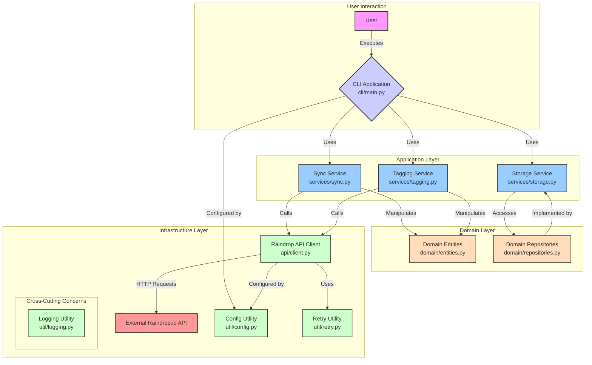

# Raindrop Enhancer Architecture

## 1. Introduction

The Raindrop Enhancer is a command-line tool designed to augment the functionality of the Raindrop.io bookmarking service. It synchronizes Raindrop data, enriches it with additional content, and provides features like automatic tagging. The application is built with a layered architecture to separate concerns and promote modularity.

## 2. Architectural Overview

The application follows a classic layered architecture:

- **User Interface (CLI):** The outermost layer, providing a command-line interface for user interaction.
- **Application Layer:** Contains the core business logic and orchestrates the different services.
- **Domain Layer:** Defines the core data models (entities) and their storage interfaces (repositories).
- **Infrastructure Layer:** Handles communication with external systems (like the Raindrop.io API) and provides common utilities.

## 3. Component Breakdown

### 3.1. User Interface (CLI)

- **File:** `src/raindrop_enhancer/cli/main.py`
- **Purpose:** This module implements the command-line interface using the `click` library. It serves as the main entry point for the application.
- **Key Functions:**
    - `app()`: The main `click` group for the CLI.
    - `configure()`: A command to configure the application, including the Raindrop.io API token and other settings.
    - `sync()`: A command to trigger the synchronization process (either full or incremental).
    - `status()`: A command to show the status of recent synchronization runs.

### 3.2. Application Layer

This layer contains the services that implement the application's business logic.

#### `services/sync.py`

- **Purpose:** Orchestrates the synchronization process. It fetches data from the Raindrop.io API, enriches it, and stores it locally.
- **Key Functions:**
    - `run_full_sync()`: Performs a full synchronization of all Raindrop.io data. It iterates through collections and raindrops, enriches each link with its content, and persists it using the repository.
    - `enrich_link()`: Fetches the content of a URL, computes a hash of the content, and determines if it needs manual review.
    - `fetch_content()`: Fetches the content of a URL using `requests` and extracts the main text using `trafilatura` (if available).

#### `services/tagging.py`

- **Purpose:** Provides a service for suggesting tags for content.
- **Classes:**
    - `TaggingAdapter`: An adapter that can be configured to use a real LLM API or a mock implementation for testing.
- **Key Functions:**
    - `suggest_for_batch()`: Takes a batch of texts and returns a list of suggested tags for each text.

#### `services/storage.py`

- **Purpose:** Provides helper functions for storing data.
- **Key Functions:**
    - `write_export()`: Writes data to a JSON file, including schema version and metadata.

### 3.3. Domain Layer

This layer defines the core data structures and their persistence mechanisms.

#### `domain/entities.py`

- **Purpose:** Defines the domain entities using `SQLModel`. These entities map to database tables.
- **Key Classes:**
    - `LinkRecord`: Represents a single bookmark (raindrop).
    - `Collection`: Represents a Raindrop.io collection.
    - `TagSuggestion`: Represents a suggested tag for a link.
    - `SyncRun`: Records information about a synchronization run.
    - `ConfigSettings`: Represents the application's configuration settings.

#### `domain/repositories.py`

- **Purpose:** Implements the repository pattern for data access, using SQLite and `SQLModel`.
- **Classes:**
    - `Repo`: A repository class that provides methods for creating, reading, updating, and deleting domain entities.
- **Key Methods:**
    - `setup()`: Initializes the database and creates the tables.
    - `upsert_link()`: Inserts or updates a `LinkRecord`.
    - `get_link_by_raindrop_id()`: Retrieves a `LinkRecord` by its Raindrop.io ID.
    - `list_pending_links()`: Lists all links that are pending processing.
    - `upsert_tag_suggestions()`: Stores tag suggestions for a link.
    - `upsert_sync_run()`: Stores a record of a synchronization run.

### 3.4. Infrastructure Layer

This layer handles external communication and provides common utilities.

#### `api/client.py`

- **Purpose:** Implements a client for the Raindrop.io API.
- **Classes:**
    - `RaindropClient`: A client that handles authentication, pagination, and rate limiting for the Raindrop.io API.
- **Key Methods:**
    - `list_collections()`: Fetches the list of collections from the Raindrop.io API.
    - `list_raindrops()`: Fetches the raindrops for a given collection, handling pagination.

#### `util/config.py`

- **Purpose:** Manages the application's configuration, which is stored in a TOML file.
- **Key Functions:**
    - `get_or_create_config()`: Reads the configuration file or creates it with default values if it doesn't exist.
    - `write_config()`: Writes the configuration to the TOML file.
    - `validate_config()`: Validates the configuration values.

#### `util/logging.py`

- **Purpose:** Provides a configured logger for the application.
- **Key Functions:**
    - `structured()`: A helper function for emitting structured (JSON) logs.

#### `util/retry.py`

- **Purpose:** Provides a simple retry mechanism with exponential backoff.
- **Key Functions:**
    - `retryable()`: A decorator that can be applied to functions to make them retryable.

## 4. Data Flow: Full Synchronization

1.  The user executes the `sync --mode=full` command.
2.  The `cli/main.py` module parses the command and calls the `run_full_sync()` function in `services/sync.py`.
3.  `run_full_sync()` uses the `RaindropClient` (`api/client.py`) to fetch all collections and then all raindrops within each collection from the Raindrop.io API.
4.  For each raindrop, `run_full_sync()` calls `enrich_link()` to fetch the content of the link's URL.
5.  `enrich_link()` uses `fetch_content()` to get the HTML of the page and `trafilatura` to extract the main text content.
6.  The enriched link data is then used to create a `LinkRecord` entity (`domain/entities.py`).
7.  The `Repo` class (`domain/repositories.py`) is used to `upsert` (insert or update) the `LinkRecord` into the SQLite database.
8.  If a `TaggingAdapter` is provided, `run_full_sync()` uses it to get tag suggestions for the content.
9.  The tag suggestions are stored in the database using the `Repo`.
10. Finally, `run_full_sync()` writes an export of the synchronized data to a JSON file using `write_export()` from `services/storage.py` and records the details of the sync run in the database.

## 5. Architecture Diagram

