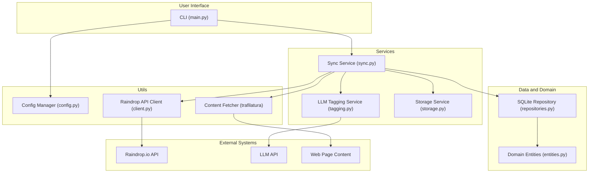

# Raindrop Enhancer Architecture

This document provides a comprehensive overview of the Raindrop Enhancer application's architecture. It details the key components, their interactions, and the overall design principles.

## 1. High-Level Overview

The Raindrop Enhancer is a Python-based command-line tool designed to enrich [Raindrop.io](https://raindrop.io/) bookmarks. It fetches bookmarks from a user's Raindrop account, extracts the content of the bookmarked pages, and uses a Large Language Model (LLM) to suggest relevant tags. The application persists its state in a local SQLite database and can export the enriched data to JSON files.

The architecture is modular, following a clean separation of concerns between the user interface, application logic, domain model, and external service integrations.

## 2. Core Components

The application is structured into several key components, each with a distinct responsibility.

### 2.1. Command-Line Interface (CLI)

-   **File:** `src/raindrop_enhancer/cli/main.py`
-   **Framework:** [Click](https://click.palletsprojects.com/)

The CLI is the main entry point for user interaction. It provides commands for:

-   `configure`: Setting up API tokens and other configuration.
-   `sync`: Running a full or incremental synchronization of Raindrop bookmarks.
-   `reprocess`: Re-enriching a single bookmark.
-   `status`: Viewing the history of synchronization runs.

The CLI module is responsible for parsing user input, orchestrating the application services, and presenting the output to the user in either a human-readable or JSON format.

### 2.2. Raindrop API Client

-   **File:** `src/raindrop_enhancer/api/client.py`

This component is a dedicated client for interacting with the Raindrop.io REST API. It handles:

-   Authentication using a bearer token.
-   Fetching collections and bookmarks (raindrops).
-   Pagination for retrieving large numbers of bookmarks.
-   Rate limit handling by respecting `X-RateLimit-*` headers.
-   Automatic retries with exponential backoff for transient network errors, utilizing the `util/retry.py` module.

### 2.3. Domain Model

The domain model defines the core data structures and persistence logic of the application. It uses [SQLModel](https://sqlmodel.tiangolo.com/) for ORM and data validation.

#### 2.3.1. Entities

-   **File:** `src/raindrop_enhancer/domain/entities.py`

This file defines the database schema using SQLModel classes:

-   `LinkRecord`: Represents a single Raindrop bookmark, including its metadata and processing state (`pending`, `processed`, `manual_review`).
-   `Collection`: Represents a Raindrop collection.
-   `TagSuggestion`: Stores the tags suggested by the LLM for a specific link, along with a confidence score.
-   `SyncRun`: An audit log entry for each synchronization run.
-   `ConfigSettings`: Persisted CLI configuration.

#### 2.3.2. Repository

-   **File:** `src/raindrop_enhancer/domain/repositories.py`

The `SQLiteRepository` class provides a data access layer that abstracts the interactions with the SQLite database. It offers methods for:

-   Creating and setting up the database schema.
-   `upsert_link`: Inserting or updating links, their collections, and tag suggestions in a single transaction.
-   Querying for links, collections, and sync runs.

### 2.4. Application Services

These services contain the core business logic of the application.

#### 2.4.1. Sync Service

-   **File:** `src/raindrop_enhancer/services/sync.py`

This is the heart of the application, orchestrating the entire synchronization and enrichment process. Key responsibilities include:

-   **`run_full_sync` & `run_incremental_sync`**: Entry points for the two sync modes.
-   Fetching collections and bookmarks from the Raindrop API client.
-   Determining which bookmarks need processing based on the sync mode and their last update time.
-   Using a `content_fetcher` (which uses the `trafilatura` library) to download and extract the main content from each bookmark's URL.
-   Coordinating with the `TaggingService` to get tag suggestions.
-   Persisting the state of each bookmark (e.g., `processed`, `manual_review`) to the database via the repository.
-   Recording each sync run in the audit trail.

#### 2.4.2. Tagging Service

-   **File:** `src/raindrop_enhancer/services/tagging.py`

This service integrates with an external LLM API to generate tags.

-   It prepares the extracted content from bookmarks and sends it to the LLM API in batches.
-   It processes the LLM's response, filters tags based on a confidence threshold, and limits the maximum number of tags per bookmark.
-   It includes retry logic for handling transient LLM API failures.

#### 2.4.3. Storage Service

-   **File:** `src/raindrop_enhancer/services/storage.py`

A simple utility for writing the enriched data to JSON files. It ensures atomic writes to prevent data corruption and avoids unnecessary writes if the content has not changed.

### 2.5. Utilities

This package contains cross-cutting concerns and helper modules.

-   **`util/config.py`**: The `ConfigManager` handles loading and saving user configuration (e.g., API tokens, thresholds) from a TOML file, ensuring the file has secure permissions.
-   **`util/logging.py`**: Configures structured logging for the application, outputting logs in JSON format. It also provides a simple in-memory metrics recorder.
-   **`util/retry.py`**: A generic, reusable retry helper with exponential backoff and jitter. It's used by both the Raindrop API client and the Tagging Service.

## 3. Data Flow (Sync Process)

A typical `sync` operation follows this sequence:

1.  The user runs `raindrop-enhancer sync --mode incremental` from the CLI.
2.  The `cli/main.py` module parses the command and invokes `services.sync.run_incremental_sync`.
3.  The `SyncService` loads the last sync timestamp for each collection from the `SQLiteRepository`.
4.  It calls the `RaindropClient` to fetch all bookmarks updated since the last sync.
5.  For each new or updated bookmark, the `SyncService` invokes the `content_fetcher` (`trafilatura`) to download and extract the article text.
6.  The extracted content is passed to the `TaggingService`.
7.  The `TaggingService` sends the content in batches to the configured LLM API.
8.  The LLM returns tag suggestions, which are filtered by the `TaggingService` based on the configured confidence threshold.
9.  The `SyncService` receives the suggestions and calls `SQLiteRepository.upsert_link` to save the bookmark, its new `processed` status, and the tag suggestions to the database.
10. If a bookmark fails at any stage (e.g., content extraction fails), its status is set to `manual_review`.
11. Finally, the `SyncService` uses the `storage.py` utility to write a JSON export of the entire database to the `exports` directory and records the sync run details in the `sync_runs` table.
12. The CLI displays a summary of the operation to the user.

## 4. Architecture Diagram

The following diagram illustrates the relationships between the core components:

